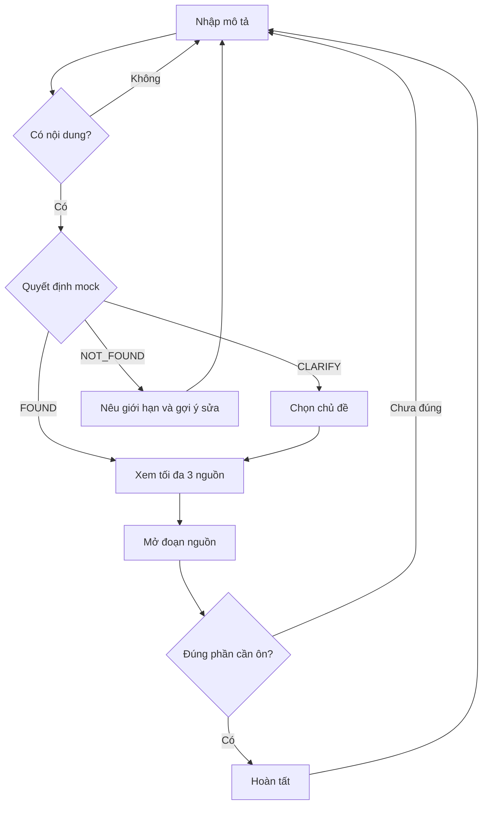

# VLearn Recall — bản mock CP2

Mở `index.html` trực tiếp bằng trình duyệt. Không cần cài thư viện, API key hay internet. Có thể phục vụ thư mục này qua HTTP nếu cần trình chiếu trong trình duyệt tích hợp.

## Kịch bản bấm thử

1. Bấm ví dụ **ReAct và gọi tool**, bấm **Tìm đoạn bài học**: nhận FOUND và hai nguồn minh họa.
2. Bấm **Mở đúng đoạn**, đọc nội dung, bấm **Đúng phần mình cần**: hoàn tất tác vụ. Bấm **Tìm nội dung khác** để về đầu.
3. Chọn ví dụ **Mình nhớ về context…**, bấm tìm: nhận CLARIFY. Chọn một trong hai chủ đề rồi mở nguồn.
4. Trong nguồn, bấm **Chưa đúng, sửa câu hỏi**: giữ câu hỏi cũ cho người dùng chỉnh và tìm lại.
5. Chọn **Nội dung ngoài bài học**, bấm tìm: nhận NOT_FOUND và đường quay lại. Bấm **Thử ví dụ ReAct** để phục hồi.
6. Bấm **Xem luồng** để trình bày sơ đồ. Đóng hộp thoại bằng nút Đóng hoặc Escape.

## Phạm vi và tính trung thực

- Đây là mock theo kịch bản/từ khóa, chưa có AI, retrieval hay chấm độ tự tin thật.
- Toàn bộ nội dung nguồn tự viết. Tên bài, số trang và timestamp đều giả lập và được gắn nhãn trong giao diện; không phải trích dẫn BTC.
- Không chứa thông tin người khảo sát, liên hệ willing user, raw data hoặc API key. Không gửi dữ liệu ra mạng, không lưu câu hỏi.
- Chỉ số dưới 45 giây là mục tiêu thiết kế, chưa phải kết quả thử nghiệm.
- Không tuyên bố Zero Hallucination hoặc lấy kết quả mock làm benchmark CP3.
- Khi tích hợp dữ liệu thật: chỉ hiển thị timestamp nếu nguồn có timestamp được kiểm chứng; nếu không, dùng mã đoạn. Kiểm tra nguồn tồn tại trước khi cho mở.

## Luồng

## Ghi chú dữ liệu Canvas trước CP4

Các tỷ lệ khảo sát do nhóm cung cấp chưa được kiểm lại bằng phản hồi gốc. N=11 là bằng chứng ban đầu; đường khảo sát chuẩn A cần ít nhất 20 người ngoài nhóm theo đề bài. Cần ghi tử số/mẫu số riêng cho mỗi câu: các tỷ lệ 50%, 62.5%, 70% có thể dùng mẫu số khác 11. Nếu ba nhóm ở câu chọn một đáp án tương ứng 4+2+2 người, tổng là 8/11 ≈72.7%, không cộng các tỷ lệ đã làm tròn thành 72.8%.
