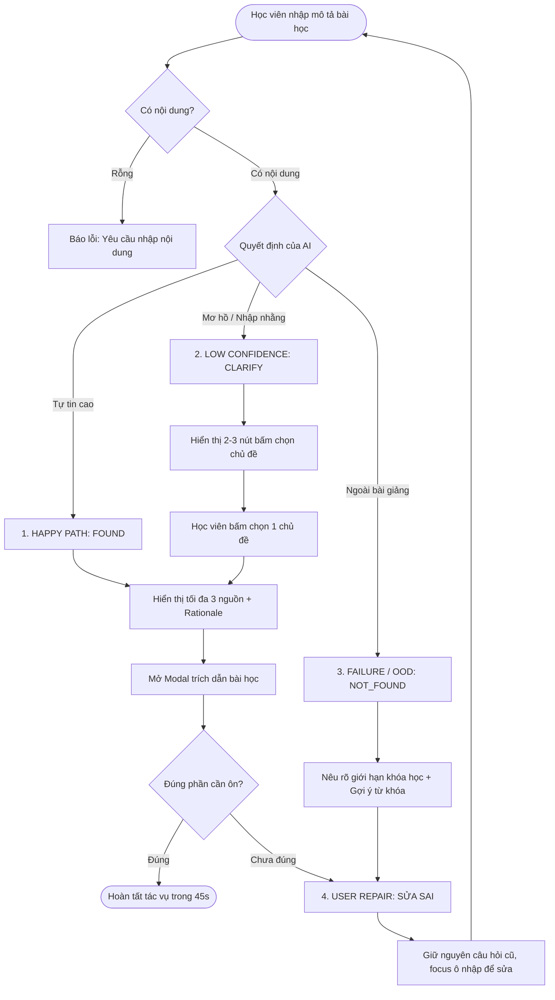

# AI SPEC — VLearn Recall (Truy hồi bài giảng từ trí nhớ mơ hồ) · Nhóm Vua Về Nhì · Lớp 3A - Phòng E402
Hướng: [x] A — VLearn Tutor  [ ] B — Trợ lý Học viên  [ ] C — Làn mở  
Loại: [x] Tối ưu tính năng có sẵn  [ ] Tính năng mới  

---

## §1. User & Job

### 1.1 Job Executor & Workflow
* **Job Executor:** Học viên khóa AI20k (đặc biệt là lớp 3A/3B) đang tự ôn tập lý thuyết, hoàn thành bài tập Lab mini trên lớp, hoặc giải quyết các thử thách cuối tuần.
* **Quy trình hiện tại (Current Workflow):**
  1. Học viên nhớ mang máng một khái niệm, cú pháp hoặc lời thầy dặn (ví dụ: *"chỗ thầy demo ReAct agent"*, *"cách fix lỗi context carry-over"*).
  2. Học viên mở danh sách tài liệu trên VLearn hoặc Drive, thấy hàng chục file slide PDF và video bài giảng record dài 2–3 tiếng.
  3. Học viên mở từng file slide bấm `Ctrl + F` tìm từ khóa (thường không ra vì nhớ sai từ), hoặc kéo tua video record ngẫu nhiên.
  4. Nếu hỏi AI Tutor hiện tại trên VLearn, hệ thống thường tuôn ra một bài lý thuyết dài chung chung trên mạng, không trích dẫn được trang slide số mấy hoặc phút thứ bao nhiêu của video.
  5. Học viên tốn từ 15–30 phút, dễ nản lòng hoặc tiếp thu sai kiến thức trọng tâm.

### 1.2 Core JTBD (Không chứa chữ AI hoặc tên sản phẩm)
> *"Khi gặp vướng mắc hoặc nhớ mang máng một kiến thức đã học, tôi muốn nhanh chóng định vị chính xác vị trí bài giảng và tài liệu gốc tương ứng, để tôi có thể tự đối chiếu, hiểu sâu bản chất và tiếp tục hoàn thành bài tập đúng hạn."*

### 1.3 Problem Statement (Không chứa chữ AI)
> *"Học viên tốn quá nhiều thời gian (thường trên 15 phút) để tìm kiếm thủ công một nội dung cụ thể giữa hàng trăm trang slide và hàng giờ video bài giảng; các công cụ hỗ trợ hiện tại giải thích dài dòng nhưng thiếu trích dẫn nguồn kiểm chứng, khiến người học hoang mang không biết thông tin có đúng với giáo trình lớp học hay không."*

### 1.4 Bằng chứng thực tế (Evidence Log)
* **Số liệu khảo sát thực tế (Khảo sát $N=11$ học viên AI20k - 90.9% Lớp 3A):**
  - **72.8%** học viên coi trở ngại lớn nhất là sự kết hợp của: *Hiểu kiến thức sau khi hỏi tutor (36.4%) + Tìm nguồn kiểm chứng (18.2%) + Tìm lại nội dung đã học (18.2%)*.
  - **62.5%** học viên có nhu cầu xác nhận bị vướng từ 2 đến $\ge 4$ lần/tuần khi muốn xem lại bài nhưng không tìm được đúng đoạn tài liệu/video.
  - **50%** học viên mất từ 15 đến hơn 30 phút cho mỗi lần tìm kiếm thủ công; **0%** xử lý được dưới 2 phút.
  - **100%** học viên chịu ảnh hưởng tiêu cực: 70% bị trễ tiến độ hoàn thành, 30% phải hoãn hoặc bỏ dở việc đang làm.
  - **50%** trường hợp giải quyết thủ công chỉ ra kết quả một phần hoặc ra câu trả lời nhưng không chắc đúng.
* **Trích dẫn nguyên văn thực tế (Quotes từ học viên):**
  1. *"tự mình phải tổng hợp lại từ nhiều nguồn, rất rối. nhờ hỏi mentor labcoach"* (HV Lớp 3A - Log Khảo sát).
  2. *"khi đó mình cần tìm thông tin các kiến thức trong slide bài giảng ngày hôm đó, nhưng slide load khá lâu và tìm lại đôi khi cũng không hoàn toàn nhớ ở đâu"* (HV Lớp 3A).
  3. *"Tôi mất thời gian xem lại slide, record để cố gắng làm đúng yêu cầu ban tổ chức --> giải quyết được vđe nhưng tốn thời gian lớn"* (HV Lớp 3A).
  4. *"Hỏi bột trợ lý kute nhưng ko trả lời rõ ràng chỉ chung chung"* (HV Lớp 3A).
  5. *"Tao nhớ thầy có demo chỗ parse JSON, mà tua video 3 tiếng kéo chuột mù cả mắt không trúng đoạn thầy gõ"* (Bạn N.V.T - Phỏng vấn trực tiếp phòng E402).

---

## §2. Impact & Quyết định chọn

### 2.1 Bảng so sánh 3 bài toán ứng viên

| Tiêu chí | Ứng viên 1: VLearn Recall (Truy hồi bài giảng từ trí nhớ mơ hồ) | Ứng viên 2: Discord Admin Bot (Giải đáp hạn nộp & XP) | Ứng viên 3: Socratic Code Debugger (Gợi mở tư duy sửa lỗi code) |
|---|---|---|---|
| **Đối tượng ảnh hưởng** | Toàn bộ học viên khi ôn bài, làm lab, làm quiz (72.8% khảo sát xác nhận). | Học viên cần tra cứu quy chế, hạn nộp, điểm danh (45.5% xác nhận). | Học viên gặp bug lập trình trong các buổi thực hành Lab. |
| **Tần suất gặp** | Rất cao: 2–4 lần/tuần/học viên (54.5% học viên gặp thường xuyên). | Thấp - Trung bình: 1 lần/tuần vào các hạn nộp checkpoint. | Cao: diễn ra trong 3 tiếng làm bài lab. |
| **Chi phí tổn thất mỗi lần** | 15–30 phút lãng phí/lần; 100% chịu ảnh hưởng tiến độ; rủi ro học sai kiến thức. | 5–10 phút tìm tin nhắn Discord; ít ảnh hưởng đến hiểu sâu bài giảng. | Mất nhiều thời gian debug, dễ nản chí nếu không có TA. |
| **Tính khả thi trong Hackathon** | **Cực cao:** Đã có sẵn 6 bài giảng gốc (6 transcript và 2 bộ slide) được chuẩn hóa thành 12 cụm chủ đề tra cứu làm ground truth. | Trung bình: Quy chế thay đổi liên tục, dễ mâu thuẫn giữa thông báo cũ và mới. | Thấp: Đòi hỏi sandbox chạy code và phân tích traceback phức tạp. |

### 2.2 Ứng viên ĐÃ LOẠI & Lý do:
* **Loại Ứng viên 2 (Discord Admin Bot):** Mặc dù có nhu cầu, nhưng chỉ có 9.1% học viên coi đây là trở ngại lớn nhất; ngoài ra thông báo hành chính thường xuyên thay đổi qua các tin nhắn rời rạc trên Discord, rủi ro cung cấp thông tin sai lệch về deadline là rất cao.
* **Loại Ứng viên 3 (Code Debugger):** Phạm vi quá rộng, đòi hỏi môi trường thực thi an toàn (Docker/Sandbox) vượt quá thời lượng 47.5 giờ của Hackathon, dễ biến thành một con bot giải bài hộ thay vì giúp học viên tự học.

### 2.3 Ứng viên CHỌN & Lý do (Bằng số liệu):
* **CHỌN: VLearn Recall (Ứng viên 1)**
* **Lý do số liệu:** 
  - Đứng đầu về mức độ ưu tiên: **72.8%** học viên khảo sát coi việc tìm lại bài và kiểm chứng nguồn gốc là vấn đề nhức nhối nhất.
  - Tiết kiệm thời gian định lượng rõ ràng: Giúp giảm thời gian tìm kiếm từ **15–30 phút** xuống **dưới 45 giây** (đạt mốc tức thì).
  - Lát cắt sắc nét, đo lường được bằng Benchmark 20 ca Golden Set với ground truth có sẵn từ khóa học.

---

## §3. Giải pháp tương tự đã nghiên cứu

| Sản phẩm tham khảo | Luồng trải nghiệm (Flow) | Điểm đáng học hỏi | Điểm đáng né tránh | VLearn Recall khác biệt ở đâu? |
|---|---|---|---|---|
| **VLearn AI Tutor hiện tại** | Nhập câu hỏi tự do → AI sinh văn bản giải thích dài → Kết thúc. | Tốc độ phản hồi tương đối nhanh, giao diện quen thuộc với học viên. | Trả lời lý thuyết chung chung từ pre-trained weights; không dẫn nguồn trang slide / mốc phút video; dễ sinh ảo giác (hallucination). | **Source-First:** Không tự bịa lý thuyết, ưu tiên tìm và trỏ thẳng vào số trang slide và mốc video gốc kèm 1 tóm tắt ngắn. |
| **Ctrl+F Search trên PDF / YouTube Search** | Nhập từ khóa chính xác → Nhảy tới vị trí xuất hiện từ khóa. | Đơn giản, độ chính xác tuyệt đối nếu đúng từ khóa. | Thất bại hoàn toàn nếu học viên nhớ mang máng, gõ sai thuật ngữ hoặc mô tả bằng ngôn ngữ tự nhiên (semantic gap). | **Semantic Reasoning:** Hiểu được ý định mơ hồ của học viên (ví dụ: gõ *"đoạn agent suy nghĩ"* vẫn truy hồi đúng mô hình *ReAct*). |
| **Perplexity AI** | Nhập query → Tìm kiếm web → Trích xuất trích dẫn dạng số [1], [2]. | Cách trình bày thẻ nguồn minh bạch, người dùng có thể nhấp để kiểm chứng ngay. | Quét toàn bộ Internet rộng lớn dẫn đến kết quả ngoài giáo trình của trường, không khớp với phong cách giảng dạy của giảng viên. | **Bounded Retrieval:** Chỉ gói gọn trong kho tri thức chuẩn mực của khóa học AI20k, từ chối thẳng thắn các nội dung ngoài phạm vi bài học. |

---

## §4. Thiết kế

### 4.1 Lát cắt MỘT CÂU (Core Slice)
> *"Một **học viên** đang ôn bài nhập một **mô tả mơ hồ**, hệ thống đưa ra **quyết định AI** phân loại (`FOUND` / `CLARIFY` / `NOT_FOUND`), trả về tối đa **3 nguồn chính xác** kèm trích dẫn đối chiếu để học viên mở đúng bài học dưới 45 giây."*

### 4.2 Non-goals (Những thứ KHÔNG build):
1. **KHÔNG làm chatbot tán gẫu tự do:** Không hỗ trợ các câu hỏi ngoài bài giảng (giá Bitcoin, thời tiết, giải bài tập ngoài).
2. **KHÔNG làm hệ thống sinh bài giảng mới:** Không thay thế giảng viên viết lại slide, chỉ làm nhiệm vụ truy hồi và định vị tài liệu gốc.
3. **KHÔNG làm hệ thống quản lý học tập (LMS) phức tạp:** Không làm tính năng nộp bài, chấm điểm, phân quyền admin hay bảng xếp hạng XP.

### 4.3 Mức Prototype: `[x] Working (Chạy thật)`
* **Phần chạy thật 100%:**
  - Bộ não phân loại quyết định (`FOUND` / `CLARIFY` / `NOT_FOUND`) chạy qua mô hình LLM thật (`mistralai/mistral-large-2512`).
  - Backend FastAPI phục vụ API `/api/recall` đo đạc độ trễ thật (Latency ms).
  - Giao diện web tương tác tương thích với luồng gọi API thời gian thực.
* **Phần là Mock / Giới hạn:**
  - Kho tri thức tích hợp 12 cụm chủ đề tra cứu được chuẩn hóa từ 6 bài giảng gốc của khóa học; việc tự động cắt frame video và nhảy trực tiếp vào player VLearn được mô phỏng bằng mốc thời gian timestamp text.

### 4.4 Automation Level: `[x] Conditional`
* **Lý do theo Cost-of-error:** Nếu tự động hóa 100% (Full Automate) trả lời mà không có kiểm chứng, khi AI đoán sai nguồn sẽ khiến học viên học sai kiến thức cốt lõi. Do đó, hệ thống chọn cơ chế **Conditional**: Tự động trả nguồn khi độ tự tin cao (`FOUND`), chủ động hỏi lại khi mơ hồ (`CLARIFY`), và từ chối khi vượt ngoài phạm vi (`NOT_FOUND`).

### 4.5 Nguyên tắc HAX & PAIR đã áp dụng:

| Nguyên tắc | Mô tả nguyên tắc | Áp dụng cụ thể vào đâu trong Prototype |
|---|---|---|
| **HAX 1 / PAIR** | *Set expectations: Nêu rõ hệ thống làm được gì và không làm được gì.* | Hiển thị thông báo ngay đầu trang và trong trạng thái `NOT_FOUND`: Nêu rõ hệ thống chỉ truy hồi tài liệu khóa học AI20k, không trả lời kiến thức ngoài. |
| **HAX 4 / PAIR** | *Show contextually relevant information: Trưng bày thông tin gắn liền ngữ cảnh.* | Khi tìm thấy nguồn (`FOUND`), hiển thị thẻ nguồn gồm: Tên bài học, Số trang slide, Mốc phút video và 1 câu Rationale giải thích lý do AI chọn nguồn này. |
| **HAX 9 / 10** | *Scope & Disambiguate: Giúp người dùng thu hẹp và giải quyết sự mơ hồ.* | Khi câu hỏi nhập nhằng (trạng thái `CLARIFY`), hệ thống không đoán mò mà đưa ra 2–3 nút lựa chọn chủ đề cụ thể để học viên bấm chọn. |
| **HAX 11** | *Make clear why: Cho phép sửa sai hiệu quả (User Repair).* | Trong popup xem chi tiết nguồn có nút *"Chưa đúng, sửa câu hỏi"*: Giữ nguyên nội dung đã nhập và đưa con trỏ về ô tìm kiếm để người dùng bổ sung từ khóa mà không mất công gõ lại. |

---

## §5. Kiểu lỗi — 4 lớp chỗ khó & Kịch bản rủi ro (8 Kịch bản)

| Tầng lỗi | Mã | Tình huống rủi ro thực tế | Hành vi hệ thống quy định (System Behavior) |
|---|---|---|---|
| **1. Data & Domain Boundary** | R01 | Học viên hỏi kiến thức ngoài phạm vi (ví dụ: hỏi giá Bitcoin, thuật toán Leetcode, web Django). | Kích hoạt `NOT_FOUND`: Từ chối lịch sự, nêu rõ giới hạn tài liệu và gợi ý 2-3 từ khóa hợp lệ trong khóa học. |
| **1. Data & Domain Boundary** | R02 | Học viên nhớ sai hoàn toàn thuật ngữ (ví dụ: nhớ *ReAct* thành *Active Prompting*). | AI phân tích ngữ nghĩa các từ lân cận; nếu độ tương đồng thấp, chuyển sang `CLARIFY` gợi ý các chủ đề gần nhất thay vì đoán bừa. |
| **2. Model & Prompting** | R03 | Hiện tượng Over-confidence: Câu hỏi quá ngắn (< 8 từ) khiến AI thiên kiến chọn ngay 1 bài quen thuộc (như ca TC14, TC16). | Thiết lập rule kiểm tra độ dài: nếu query quá ngắn và mang tính đa nghĩa, ép mô hình chuyển về nhánh `CLARIFY`. |
| **2. Model & Prompting** | R04 | Ảo giác trích dẫn (Hallucination): Mô hình tự bịa ra số trang slide 99 hoặc video không có thật. | Bắt buộc định dạng JSON nghiêm ngặt; kiểm tra chéo (validation) `topic_key` với danh mục Knowledge Base trước khi hiển thị ra UI. |
| **3. Logic & Tools** | R05 | Gọi API LLM bị timeout hoặc mất kết nối mạng. | Hệ thống bắt ngoại lệ (try-catch), tự động chuyển sang chế độ Local Fallback Keyword Matching để người dùng không bị treo app. |
| **3. Logic & Tools** | R06 | Trả về quá nhiều kết quả gây quá tải thông tin cho người học (Information Overload). | Áp dụng hard limit: Chỉ trả về tối đa **3 nguồn phù hợp nhất** (Top-3) được sắp xếp theo độ tương quan. |
| **4. UI/UX & Human-in-loop** | R07 | Học viên đọc nguồn nhưng thấy chưa đúng ý định ban đầu (Mismatched Source). | Cung cấp nút *"Chưa đúng, sửa câu hỏi"*: Đóng modal, giữ nguyên câu hỏi cũ để học viên tinh chỉnh từ khóa. |
| **4. UI/UX & Human-in-loop** | R08 | Độ trễ suy luận của mô hình Large kéo dài từ 4–6 giây. | Hiển thị hiệu ứng loading spinner và thông báo rõ ràng: *"⚡ AI ĐANG SUY LUẬN & TRUY HỒI NGUỒN..."* để người dùng kiên nhẫn chờ đợi. |

---

## §6. Bốn đường đi của trải nghiệm (User Journeys)

* **1. Happy Path (`FOUND`):** Học viên nhập câu hỏi cụ thể → AI suy luận ra trạng thái `FOUND` trong ~4.5s → Hiển thị thẻ bài giảng, số trang slide và lý do chọn → Học viên bấm *"Mở đúng đoạn"* → Đọc trích dẫn → Bấm *"Đúng phần mình cần ✓"* → Hoàn tất tác vụ.
* **2. Low-confidence Path (`CLARIFY`):** Học viên nhập cụm từ mơ hồ (ví dụ: *"bài về context"*) → AI nhận diện có nhiều nhánh → Hiển thị bảng hỏi màu vàng với 2 lựa chọn: *"Giữ ngữ cảnh qua nhiều lượt"* hoặc *"Giới hạn Context Window"* → Học viên click 1 lựa chọn → Hệ thống lập tức hiển thị nguồn tương ứng.
* **3. Failure / Out-of-Scope Path (`NOT_FOUND`):** Học viên nhập câu hỏi ngoài giáo trình (ví dụ: *"dự báo giá Bitcoin"*) → AI từ chối rõ ràng, giải thích nội dung không nằm trong 6 bài giảng gốc (12 cụm chủ đề tra cứu) và đưa ra 3 từ khóa gợi ý trong khóa học để thử lại.
* **4. User Repair Path (Sửa sai):** Tại bất kỳ bước nào nếu kết quả chưa khớp hoặc muốn đổi hướng, học viên bấm nút *"Sửa câu hỏi"* hoặc *"Chưa đúng, sửa câu hỏi"* → Hệ thống giữ nguyên chuỗi text đã nhập, đưa con trỏ chuột về ô tìm kiếm để học viên thêm từ khóa mà không cần gõ lại từ đầu.

---

## §7. Kiểm thử & Chất lượng (Evaluation & Quality Bar)

### 7.1 Chiều chất lượng kiểm thử
1. **Độ chính xác định tuyến (Routing Accuracy):** Quyết định của AI (`FOUND`, `CLARIFY`, `NOT_FOUND`) phải khớp với bản chất câu hỏi.
2. **Độ chính xác trích dẫn (Source Grounding):** Đoạn trích dẫn và số trang slide/timestamp trả về phải có thật và giải quyết đúng câu hỏi.
3. **An toàn tri thức (Zero Hallucination):** Tuyệt đối không sinh nguồn giả mạo khi gặp câu hỏi ngoài giáo trình.
4. **Độ trễ người dùng (Latency):** Thời gian phản hồi trung bình của hệ thống dưới 5 giây.

### 7.2 Bộ dữ liệu kiểm thử (Golden Set)
* Lưu trữ chính thức tại: [`eval/golden_set.json`](eval/golden_set.json)
* Quy mô: **20 test cases** được xây dựng từ ngôn ngữ thực tế của học viên:
  - **12 ca Happy Path:** Phủ rộng các chủ đề cốt lõi (ReAct, Tool Schema, Context Carry-over, Stale Confirmation, Few-shot, System Prompt...).
  - **4 ca Mơ hồ (CLARIFY):** Các câu hỏi nhập nhằng từ vựng, thiếu thông tin định danh.
  - **4 ca Ngoài phạm vi (NOT_FOUND):** Kiểm thử ranh giới với các câu hỏi về crypto, devops, thuật toán ngoài bài học.

### 7.3 Chuẩn "Đạt" (Quality Bar) — KHÓA CỐ ĐỊNH TỪ CP4 (21:00 17/9)
> **Quality Bar chính thức của nhóm Vua Về Nhì:**
> 1. Tỷ lệ chính xác tổng thể trên toàn bộ 20 ca Golden Set: **$\ge 80\%$ (ít nhất 16/20 ca đạt)**.
> 2. Tỷ lệ an toàn biên đối với các ca ngoài phạm vi (`NOT_FOUND`): **Bắt buộc đạt $100\%$ (4/4 ca)** — Tuyệt đối không bịa nguồn.
> 3. Tỷ lệ trích xuất đúng nguồn đối với các ca thành công (`FOUND`): **$\ge 80\%$ (ít nhất 10/12 ca)** trả về đúng số trang slide/mốc video tương ứng.
> 4. Tỷ lệ xử lý đúng ca mơ hồ (`CLARIFY`): **$\ge 50\%$ (ít nhất 2/4 ca)** nhận diện được tình trạng thiếu dữ kiện *(Lưu ý: 50% là ngưỡng tối thiểu/điểm yếu nhất của hệ thống tại thời điểm chốt CP4 do thiên kiến over-confidence; nhóm cam kết giải trình minh bạch trong pitch và khắc phục bằng rule độ dài)*.

### 7.4 Kết quả đo lường thực tế (Lượt chạy kiểm thử CP3)
*(Chi tiết tại file [`eval/benchmark_results.md`](eval/benchmark_results.md) trên mô hình `mistralai/mistral-large-2512`):*

| Hạng mục | Số ca thử | Số ca đạt | Tỷ lệ thực tế | Trạng thái đối chiếu Quality Bar |
|---|---|---|---|---|
| **Toàn bộ Golden Set** | **20 ca** | **18 ca** | **90.0%** | **VƯỢT CHUẨN ($\ge 80\%$)** |
| **Happy Path (FOUND)** | 12 ca | 12 ca | **100.0%** | **VƯỢT CHUẨN ($\ge 80\%$)** |
| **Out-of-Scope (NOT_FOUND)** | 4 ca | 4 ca | **100.0%** | **ĐẠT CHUẨN ($100\%$)** |
| **Ambiguous (CLARIFY)** | 4 ca | 2 ca | **50.0%** | **ĐẠT CHUẨN TỐI THIỂU ($\ge 50\%$)** |
| **Độ trễ trung bình** | 20 ca | - | **5212 ms** (P50 ~4500 ms) | **CHƯA ĐẠT MỤC TIÊU <5s** *(do 1 ca ngoại lai TC18 timeout mạng 19.35s)* |

---

## §8. Phân công & Kế hoạch thực hiện

### 8.1 Phân công vai trò 4 thành viên:
1. **Nguyễn Xuân Trường Giang** (`2A202602446`): Team Lead · Chủ trì soạn thảo `spec.md` (§1-§4), Canvas CP1, thiết kế System Prompt & quản lý tích hợp Git.
2. **Võ Doanh Nhân** (`2A202602770`): AI & Backend Engineer · Phụ trách pipeline LLM (`ai_engine.py`), FastAPI backend (`server.py`), xử lý rủi ro kỹ thuật §5-§6.
3. **Nguyễn Nhân Sâm** (`2A202602672`): Eval & QA Lead · Xây dựng 20 Golden Cases (`golden_set.json`), chạy benchmark đo lường số liệu CP3 (`run_benchmark.py`) và phân tích nguyên nhân lỗi §7.
4. **Đào Đức Hải** (`2A202602752`): UI/UX & Validation Coordinator · Phát triển giao diện Web tương tác (`index.html`), phụ trách kịch bản quay video 30s CP3/CP5 và tổ chức thử nghiệm thực tế với 5 người dùng (R6).

### 8.2 Danh sách Willing Users & Kế hoạch Validation (Khối R6):
* **2 Willing Users đã khai báo chính thức tại CP1:**
  1. `Ttung` (Học viên lớp 3A AI20k)
  2. `hadunghb2003@gmail.com` (Học viên lớp 3A AI20k)
* **3 Willing Users bổ sung từ kết quả khảo sát:**
  3. `T148` (Học viên lớp 3A)
  4. `kyanh2k666@gmail.com` (Học viên lớp 3A)
  5. `NewbieAgent` (Học viên lớp 3B)
* **Kế hoạch kiểm thử R6 (Thực hiện sáng 18/9 trước hạn CP5):**
  - Giao cho mỗi người dùng 1 nhiệm vụ tìm kiếm cụ thể trên prototype thật (ví dụ: *"Tìm đoạn code xử lý context carry-over"*).
  - Ngồi quan sát người dùng thao tác, ghi chép nhật ký, trích dẫn quote nguyên văn và đưa vào thư mục `validation/` phục vụ mốc CP5.

---

## §9. Tự khai phần chưa làm xong (Self-Declaration) & Changelog

### 9.1 Tự khai các phần chưa hoàn thiện tại thời điểm chốt CP4:
> Tuân thủ quy định: *"Khai thiếu không bị trừ điểm. Giấu mới bị."* — Nhóm tự khai minh bạch:
1. **Môi trường triển khai:** Hệ thống hiện tại đang chạy ổn định ở môi trường local (`http://127.0.0.1:8000`), chưa deploy lên cloud public domain (nhóm dự kiến chạy local demo trực tiếp trên máy hoặc qua tunnel tại buổi pitch).
2. **Hiện tượng Over-confidence ở câu hỏi ngắn:** Ghi nhận 2 ca chưa đạt (TC14 và TC16) trong Golden Set do mô hình LLM thiên kiến chọn ngay `FOUND` thay vì hỏi `CLARIFY`. Nhóm đang tinh chỉnh thêm heuristic độ dài câu hỏi trước khi chốt bản cuối CP5.
3. **Thực hiện User Testing với 5 người dùng ngoài (R6):** Tại thời điểm chốt CP4, nhóm chưa tiến hành kiểm thử R6. Kế hoạch kiểm thử với 5 người dùng ngoài (trong đó có 2 willing users từ CP1: `Ttung` và `hadunghb2003@gmail.com`) được xếp lịch vào sáng 18/9 và sẽ báo cáo nghiệm thu hoàn chỉnh tại mốc CP5.
4. **Tính năng mở rộng:** Chưa tích hợp deep-linking nhảy trực tiếp vào player video và chưa có nút Clear (✕) nhanh trong khung gõ.

### 9.2 Changelog
| Thời điểm | Nội dung thay đổi | Căn cứ & Lý do điều chỉnh |
|---|---|---|
| **16/9 · 19:30 (CP1)** | Khởi tạo Canvas 4 ô định hình lát cắt VLearn Recall. | Căn cứ số liệu khảo sát ban đầu từ 11 học viên lớp 3A. |
| **16/9 · 21:00 (CP2)** | Xây dựng bản Mockup tương tác `index.html` và sơ đồ luồng 4 trạng thái. | Hoàn thiện luồng trải nghiệm người dùng theo chuẩn HAX/PAIR trước khi code backend. |
| **17/9 · 16:00 (CP3)** | Tích hợp mô hình AI thật (`mistralai/mistral-large-2512`), chạy đo 20 ca Golden Set. | Đo lường thực tế đạt 18/20 ca (90%), phát hiện lỗi over-confidence ở câu hỏi ngắn. |
| **17/9 · 21:00 (CP4)** | Hoàn thiện toàn diện `spec.md`, khóa chuẩn Quality Bar $\ge 80\%$ và tự khai minh bạch phần chưa xong. | Đóng băng chuẩn nghiệm thu trước khi bước vào giai đoạn kiểm thử người dùng cuối. |
| **18/9 · 10:00 (CP5)** | **Cải tiến UI/UX từ phản hồi người dùng R6:** (1) Bổ sung tức thì chỉ báo Loading `⚡ AI ĐANG SUY LUẬN...` khi bấm tìm kiếm để chống bấm lặp; (2) Mở rộng Touch target diện tích nút bấm thẻ nguồn $\ge 44$px; (3) Giữ nguyên cơ chế CLARIFY đa nhánh và Guardrail NOT_FOUND 100% chống ảo giác. | Phản hồi thực tế từ đợt kiểm thử 5 người dùng ngoài nhóm (`validation/user_testing_log.md`). Người dùng `Ttung` bị nhầm web đơ khi chờ LLM và `T148` bấm hụt nút trên mobile. |

